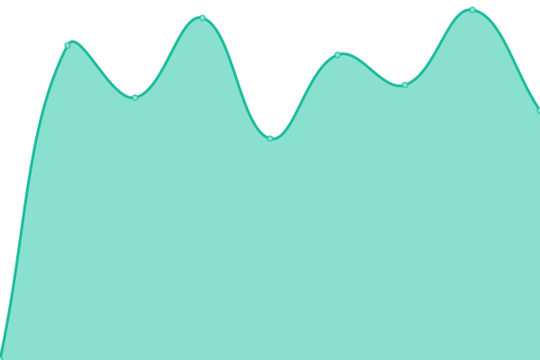
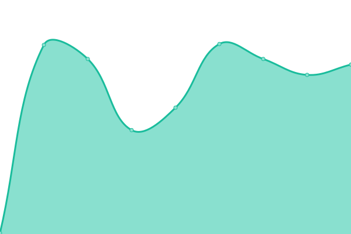

# Earpocket Status

Public status page and uptime monitor for [Earpocket](https://www.earpocket.com) services, powered by [Upptime](https://github.com/upptime/upptime).

<!--start: status pages-->
<!-- This summary is generated by Upptime (https://github.com/upptime/upptime) -->
<!-- Do not edit this manually, your changes will be overwritten -->
<!-- prettier-ignore -->
| URL | Status | History | Response Time | Uptime |
| --- | ------ | ------- | ------------- | ------ |
|  [API](https://api.earpocket.com/health) | 🟩 Up | [api.yml](https://github.com/whiletrue-love/earpocket-status/commits/HEAD/history/api.yml) | 

 862ms
     
 | 

<a href="https://status.earpocket.com/history/api">100.00%</a>
    

|  [RSS Feeds](https://feeds.earpocket.com/health) | 🟩 Up | [rss-feeds.yml](https://github.com/whiletrue-love/earpocket-status/commits/HEAD/history/rss-feeds.yml) | 

 646ms
     
 | 

<a href="https://status.earpocket.com/history/rss-feeds">99.05%</a>
    

|  [CDN](https://cdn.earpocket.com) | 🟩 Up | [cdn.yml](https://github.com/whiletrue-love/earpocket-status/commits/HEAD/history/cdn.yml) | 

 300ms
     
 | 

<a href="https://status.earpocket.com/history/cdn">100.00%</a>
    

|  [Widget](https://widget.earpocket.com) | 🟩 Up | [widget.yml](https://github.com/whiletrue-love/earpocket-status/commits/HEAD/history/widget.yml) | 

 172ms
     
 | 

<a href="https://status.earpocket.com/history/widget">99.06%</a>
    

|  [Website](https://earpocket.com) | 🟩 Up | [website.yml](https://github.com/whiletrue-love/earpocket-status/commits/HEAD/history/website.yml) | 

 191ms
     
 | 

<a href="https://status.earpocket.com/history/website">100.00%</a>
    

<!--end: status pages-->

## Monitored Services

- **API** — `api.earpocket.com/health`
- **RSS Feeds** — `feeds.earpocket.com`
- **CDN** — `cdn.earpocket.com`
- **Widget** — `widget.earpocket.com`
- **Website** — `www.earpocket.com`
